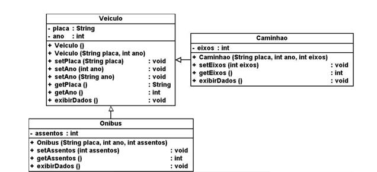

<h1 align="center">
   
  C214_L1 
   
</h1>

<h4 align="center">Este repositório foi criado a fim de armazenar as atividades realizadas no laboratório da matéria de Engenharia de Software.
</h4>

<h4 align="center"> 
</h4>

  <a href="#revisao-poo">Revisao POO</a> •
  <a     href="#gerencia-de-dependencias">Gerencia de Dependencias</a> •
  <a     href="#especificacoes">Especificacoes</a> •
    

## Revisao POO

Para revisar os conteitos de Programação Orientada a Objetos, foi implementado um código com as classes, métodos e relacionamentos impostos no diagrama abaixo:

<h4 align="center">
 </h4>

## Gerencia de Dependencias

Foi realizado o desenvolvimento de uma calculadora que realiza 5 funções matemáticas: 
* Soma 
* Subtração
* Multiplicação
* Divisão
* Exponenciação

Antes de realizar o cálculo, a calculadora valida o tipo de variável recebida, caso não seja um número é apresentado uma mensagem de erro no lugar do resultado.

## Especificacoes

Todas as atividades são desenvolvidas utilizando a linguagem JavaScript.

<h4 align="center">

</h4>

## Colaboradores

<h4 align="center">
 
  <a href=“https://github.com/DaianeDionisio“>Daiane Dionisio de Lima</a>  
</h4>